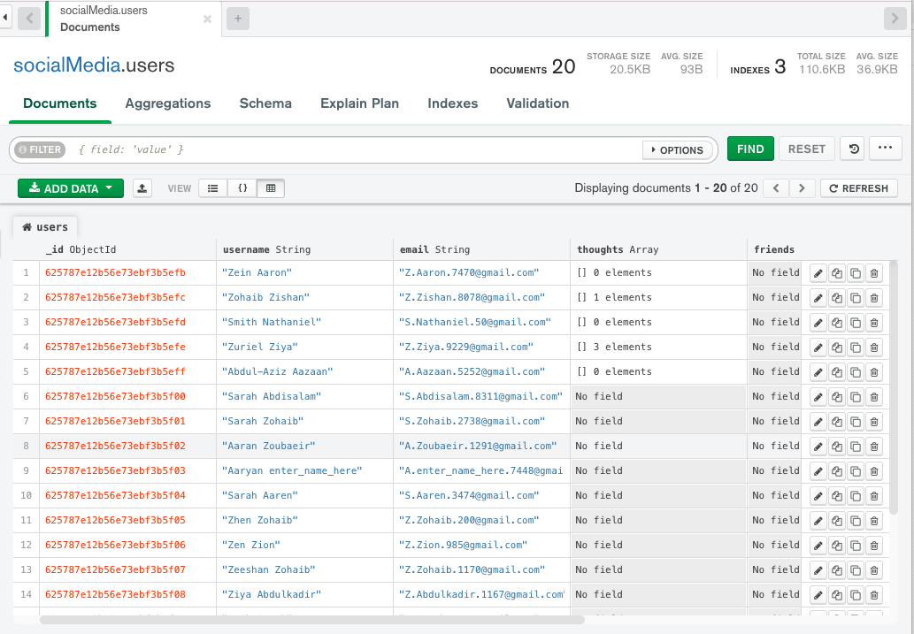

<div align="center">
  <h3 align="center">Social Network API</h3>

  <p align="center">
    This API is built for a social network web application where users can share their thoughts, react to friends’ thoughts, and create a friend list. Express.js, MongoDB database and the Mongoose ODM are used for routing, 
    <br />
    <a href="https://github.com/heranYang93/social-network-api/blob/main/demo/DEMO-socialNetworkApi-userRouters.mp4">View User Routers Demo</a>
    ·
    <a href="https://github.com/heranYang93/social-network-api/blob/main/demo/DEMO-socialNetworkApi-thoughtsRouters.mp4">View Thought Routers Demo</a>
    ·
    <a href="https://github.com/heranyang93/social-network-api/issues">Report Bug</a>
    ·
    <a href="https://github.com/heranyang93/social-network-api/issues">Request Feature</a>
  </p>
</div>

<details>
  <summary>Table of Contents</summary>
  <ol>
    <li>
      <a href="#about-the-project">About The Project</a>
      <ul>
        <li><a href="#user-story">User Story</a></li>
        <li><a href="#acceptance-criteria">Acceptance Criteria</a></li>
        <li><a href="#built-with">Built With</a></li>
      </ul>
    </li>
    <li>
      <a href="#getting-started">Getting Started</a>
      <ul>
        <li><a href="#prerequisites">Prerequisites</a></li>
        <li><a href="#installation">Installation</a></li>
      </ul>
    </li>
    <li><a href="#usage">Usage</a></li>
    <li><a href="#contact">Contact</a></li>
  </ol>
</details>

## About The Project



MongoDB is a popular choice for many social networks due to its speed with large amounts of data and flexibility with unstructured data. This project is to build an API for a social network web application where users can share their thoughts, react to friends’ thoughts, and create a friend list. I have used Express.js for routing, a MongoDB database, and the Mongoose ODM. In addition to using the [Express.js](https://www.npmjs.com/package/express) and [Mongoose](https://www.npmjs.com/package/mongoose) packages, I have also used a JavaScript to format timestamps.

<p align="right">(<a href="#top">back to top</a>)</p>

### User Story

```md
AS A social media startup
I WANT an API for my social network that uses a NoSQL database
SO THAT my website can handle large amounts of unstructured data
```

<p align="right">(<a href="#top">back to top</a>)</p>

### Acceptance Criteria

```md
GIVEN a social network API
WHEN I enter the command to invoke the application
THEN my server is started and the Mongoose models are synced to the MongoDB database

WHEN I open API GET routes in Insomnia for users and thoughts
THEN the data for each of these routes is displayed in a formatted JSON

WHEN I test API POST, PUT, and DELETE routes in Insomnia
THEN I am able to successfully create, update, and delete users and thoughts in my database

WHEN I test API POST and DELETE routes in Insomnia
THEN I am able to successfully create and delete reactions to thoughts and add and remove friends to a user’s friend list
```

<p align="right">(<a href="#top">back to top</a>)</p>

### Built With

The following dependencies/resources have been used:

- [Node.js](https://nodejs.org/en/)
- [Express.js](https://www.npmjs.com/package/express)
- [MongoDB](https://www.mongodb.com)
- [Mongoose](https://www.npmjs.com/package/mongoose)

<p align="right">(<a href="#top">back to top</a>)</p>

## Getting Started

### Prerequisites

- Node must be installed

### Installation

- Install all necessary dependencies
  - express.js and mongoose must be installed
  ```sh
  npm i
  ```
  - Point the terminal to the main directory and run the following command
  ```sh
  npm start
  ```

<p align="right">(<a href="#top">back to top</a>)</p>

## Usage

- Point the terminal to the main directory

- Populate the database with your own data or use the seed provided in the package
  `npm run seed`

- Initiate the server
  `npm run start`

<p align="right">(<a href="#top">back to top</a>)</p>

## Contact

Heran Yang- [LinkedIn](https://www.linkedin.com/in/heranyang/)

Project Link: [https://github.com/heranYang93/social-network-api](https://github.com/heranYang93/social-network-api)

<p align="right">(<a href="#top">back to top</a>)</p>
